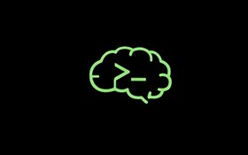

<div align="center">



<br/>

```
██████╗  ██████╗  ██████╗ ██╗   ██╗███████╗     █████╗  ██████╗ █████╗ ██████╗ ███████╗███╗   ███╗██╗   ██╗
██╔══██╗██╔═══██╗██╔════╝ ██║   ██║██╔════╝    ██╔══██╗██╔════╝██╔══██╗██╔══██╗██╔════╝████╗ ████║╚██╗ ██╔╝
██████╔╝██║   ██║██║  ███╗██║   ██║█████╗      ███████║██║     ███████║██║  ██║█████╗  ██╔████╔██║ ╚████╔╝ 
██╔══██╗██║   ██║██║   ██║██║   ██║██╔══╝      ██╔══██║██║     ██╔══██║██║  ██║██╔══╝  ██║╚██╔╝██║  ╚██╔╝  
██║  ██║╚██████╔╝╚██████╔╝╚██████╔╝███████╗    ██║  ██║╚██████╗██║  ██║██████╔╝███████╗██║ ╚═╝ ██║   ██║   
╚═╝  ╚═╝ ╚═════╝  ╚═════╝  ╚═════╝ ╚══════╝    ╚═╝  ╚═╝ ╚═════╝╚═╝  ╚═╝╚═════╝ ╚══════╝╚═╝     ╚═╝   ╚═╝  
```

*`"Knowledge is a weapon. Curated, focused, and free — learn it. Own it. Use it to shape the future of AI."`*

<br/>


</div>

---

```
// ROGUE_ACADEMY :: COURSE_01 :: ML_THEORY_STUDY_GUIDE_v1.0 █
```

## `> WHAT IS ROGUE ACADEMY?`

Rogue Academy is a self-directed AI learning initiative — built in the open, from the ground up.

It started as a personal project: a way to teach myself the foundational knowledge that actually underlies AI and deep learning — not surface-level tutorials, not API wrappers, but the real mathematical and physical intuitions that make these systems make sense.

The first course takes an unconventional path in. Rather than starting with ML textbooks, it starts with **physics** — because the ideas powering modern AI didn't appear from nowhere. Entropy, equilibrium, energy landscapes, phase transitions, dynamical systems — these were formalized in physics long before they were repurposed for machine learning. Understanding them in their original context builds a different kind of intuition: one that transfers, generalizes, and holds up when the frameworks change.

Eventually, Rogue Academy will grow into a platform that helps others explore specialized AI topics and contribute meaningfully to the field.

---

## `> CURRENT_STATUS`

```
// DEVELOPMENT PHASE — COURSE 01 ACTIVELY BEING STUDIED
```

| `PHASE` | `STATUS` |
|---|---|
| Define learning approach | `[✓] DONE` |
| Curate Course 01 resources | `[✓] DONE` |
| Build Course 01 structure | `[✓] DONE` |
| Complete Course 01 | `[~] ACTIVE` |
| Publish Course 01 | `[…] QUEUED` |
| Open to contributors | `[*] FUTURE` |
| Expand to new AI topics | `[*] FUTURE` |

---

## `> PHILOSOPHY`

```
// THREE OPERATING PRINCIPLES
```

**`[01]` CURATED OVER COMPREHENSIVE**
Not every resource deserves your time. The ones here have been selected because they build real understanding — not just familiarity with buzzwords.

**`[02]` FREE FIRST**
The core curriculum is built entirely on free, publicly available materials. Where paid resources are listed, they are clearly marked as optional and reserved for those seeking mastery.

**`[03]` DEPTH OVER BREADTH**
It's better to understand one thing well than to skim ten things poorly. Each course focuses on building genuine, transferable knowledge.

---

## `> COURSE_01 — PHYSICS AS A LENS FOR AI`

```
// STATUS: IN DEVELOPMENT
// APPROACH: PHYSICS ENTRY POINT → ML/DEEP LEARNING DESTINATION
```

Most people learning AI start with gradient descent and work backwards. This course does the opposite.

It uses **physics** as the entry point — rebuilding the mathematical and systems-thinking toolkit through mechanics, thermodynamics, information theory, and dynamical systems. The goal isn't to become a physicist. The goal is to arrive at ML and deep learning already holding the right intuitions: what it means for a system to reach equilibrium, why entropy measures uncertainty, how energy landscapes govern optimization, what it means for a system to be stable or chaotic.

> These aren't analogies. The mathematics is often literally the same. Physics came first.

**Standard workflow for every lecture:**
```
① WATCH_LECTURE  ──▶  ② READ_CHAPTER  ──▶  ③ SOLVE_EXERCISES
```

---

### `[MODULE_01]` Statistical Mechanics

```
// PRIMARY TEXT: An Introduction to Thermal Physics — Daniel V. Schroeder
// LECTURES:     Theoretical Minimum — Susskind (theoreticalminimum.com)
```

**`// WHY THIS MODULE`**

Statistical mechanics is where ML borrows most heavily from physics. The Boltzmann distribution is the mathematical ancestor of softmax. Partition functions appear throughout probabilistic modelling. Free energy minimization is what variational inference is actually doing. The entropy studied here is the same entropy that defines information content, uncertainty in predictions, and regularization in neural networks. After this module, gradient descent starts to look like a system seeking its lowest energy state — because formally, it is.

| `LECTURE` | `TOPIC` | `READING` |
|---|---|---|
| L1 | [Probability & Entropy](https://theoreticalminimum.com/courses/statistical-mechanics/2013/spring/lecture-1) | Ch. 1–2 |
| L3 | [Boltzmann Distribution](https://theoreticalminimum.com/courses/statistical-mechanics/2013/spring/lecture-3) | Ch. 6 |
| L4 | [Boltzmann Distribution & Partition Functions](https://theoreticalminimum.com/courses/statistical-mechanics/2013/spring/lecture-4) | Ch. 6–7 |
| L5 | [Helmholtz Free Energy & Ideal Gas](https://theoreticalminimum.com/courses/statistical-mechanics/2013/spring/lecture-5) | Ch. 5 + parts of Ch. 3 |

```
// AI_CONNECTIONS
> Softmax & temperature scaling  >  Boltzmann machines  >  Energy-based models
> Free energy principle  >  Entropy regularization  >  Equilibrium as convergence
```

---

### `[MODULE_02]` Information Theory

```
// PRIMARY TEXT: Information Theory, Inference, and Learning Algorithms — MacKay [FREE]
// LECTURES:     youtube.com/playlist?list=PLruBu5BI5n4aFpG32iMbdWoRVAA-Vcso6
```

**`// WHY THIS MODULE`**

This is where physics and ML meet most explicitly. Shannon entropy is a direct extension of Boltzmann entropy — same formula, different domain. Cross-entropy loss, used to train almost every classification model in existence, is a direct consequence of information-theoretic reasoning. Bayesian inference, variational methods, KL divergence, the mathematics behind VAEs and diffusion models — all of it lives here. MacKay's book treats neural networks as a natural consequence of probabilistic reasoning, not a separate subject bolted on at the end.

| `LECTURE` | `TOPIC` | `READING` |
|---|---|---|
| L1 | Introduction to Information Theory | Ch. 1 |
| L2 | Entropy & Data Compression (I) | Ch. 2 |
| L3 | Entropy & Data Compression (II) | Ch. 5 |
| L6 | Noisy Channel Coding | Ch. 8–9 |
| L9–10 | Bayesian Inference | Ch. 3–4 |
| L14 | Variational Methods | Ch. 33 |
| L15–16 | Neural Networks & Boltzmann Machines | Ch. 39–41 |

```
// AI_CONNECTIONS
> Cross-entropy loss  >  KL divergence  >  Mutual information  >  Max likelihood
> Bayesian neural networks  >  VAEs · ELBO  >  Diffusion models
```

---

### `[MODULE_03]` Nonlinear Dynamics & Chaos

```
// PRIMARY TEXT: Nonlinear Dynamics and Chaos — Steven H. Strogatz
// LECTURES:     youtube.com/playlist?list=PLbN57C5Zdl6j_qJA-pARJnKsmROzPnO9V
```

**`// WHY THIS MODULE`**

Neural networks are nonlinear dynamical systems. Training is a trajectory through a high-dimensional loss landscape. Fixed points, attractors, bifurcations, and stability — these aren't metaphors for what happens during training, they describe it precisely. Recurrent networks are literally dynamical systems evolving over time. Understanding when nonlinear systems stabilize, oscillate, or go chaotic builds the intuition needed to reason about why networks fail to converge, why they escape saddle points, and what a good solution actually means geometrically.

| `TOPIC` | `READING` | `EXERCISES` |
|---|---|---|
| One-Dimensional Systems | Ch. 2 | 2.1–2.12 |
| Two-Dimensional Linear Systems | Ch. 3 | 3.1–3.10 |
| Nonlinear Systems — Fixed Points & Stability | Ch. 4 | 4.1–4.10 |
| Limit Cycles | Ch. 5 | 5.1–5.6 |
| Bifurcations | Ch. 7 | 7.1–7.8 |
| Chaos & Lorenz Equations | Ch. 8 | 8.1–8.10 |

```
// AI_CONNECTIONS
> Loss landscape geometry  >  Saddle points & escape dynamics  >  Gradient flow
> RNNs as dynamical systems  >  Hopfield networks  >  Convergence & divergence
```

---

### `[MODULE_04]` Forecasting — Applied Time Series

```
// PRIMARY TEXT: Forecasting: Principles & Practice (Python edition) — Hyndman & Athanasopoulos [FREE]
// BOOK:         otexts.com/fpppy
// LECTURES:     youtube.com/playlist?list=PLyCNZ_xXGzpm7W9jLqbIyBAiSO5jDwJeE
```

**`// WHY THIS MODULE`**

This is where physical systems thinking gets applied computationally. Time series are the observable outputs of dynamical systems — everything from climate to financial markets to neural signals. Decomposition, smoothing, ARIMA, and state-space models are all grounded in the same reasoning used to analyse physical processes evolving over time. The transition to neural forecasting (N-BEATS, TFT) shows how deep learning enters as a generalization of classical methods — not a replacement, but an extension of the same underlying logic.

| `TOPIC` | `READING` | `PRACTICE` |
|---|---|---|
| Intro & Visualization | Ch. 2 | pandas time series + plotting |
| Decomposition | Ch. 3 | STL and seasonal_decompose |
| Exponential Smoothing (ETS) | Ch. 4 | statsmodels ExponentialSmoothing |
| ARIMA | Ch. 5 | ARIMA / auto_arima |
| Dynamic Regression | Ch. 6 | SARIMAX with exogenous variables |
| Neural Forecasting | Ch. 7–8 | N-BEATS / TFT |

```
// AI_CONNECTIONS
> State-space models  >  Sequential prediction  >  Physical systems as time series
> Classical → neural methods  >  Temporal structure in data
```

---

### `[MODULE_05]` Probabilistic Graphical Models

```
// PRIMARY TEXT: Probabilistic Graphical Models: Principles and Techniques — Koller & Friedman
// LECTURES:     youtube.com/playlist?list=PLBAGcD3siRDjiQ5VZQ8t0C7jkHQ8fhuq8
```

**`// WHY THIS MODULE`**

PGMs are the formal language for representing uncertainty and dependence between variables — the same concepts that appear in physical systems as conditional probabilities and joint distributions over states. Bayesian networks, Markov networks, and the EM algorithm connect directly to how modern generative models learn latent structure. Variational inference closes this module as the bridge between the free energy ideas in Module 1 and the practical machinery inside VAEs and diffusion models.

| `TOPIC` | `READING` |
|---|---|
| Bayesian Networks | Ch. 2–3 |
| Dynamic Bayesian Networks | Ch. 9 |
| Markov Networks & CRFs | Ch. 4–5, 7 |
| Inference | Ch. 6, 8 |
| MAP Inference | Ch. 10 |
| Learning & EM | Ch. 12–13 |
| Variational Inference | Ch. 16 |

```
// AI_CONNECTIONS
> Latent variable models  >  Generative models  >  EM algorithm
> Variational autoencoders  >  Belief propagation  >  Structured prediction
```

---

### `[MODULE_06]` Hamiltonian Mechanics

```
// PRIMARY TEXT: Classical Mechanics — John R. Taylor
// LECTURES:     theoreticalminimum.com — Lectures 1, 4, 7
```

**`// WHY THIS MODULE`**

The Hamiltonian formulation of mechanics — energy as the central object, phase space as the arena — is the conceptual ancestor of several ideas now appearing at the frontier of deep learning. Hamiltonian Monte Carlo is a direct application used in Bayesian inference. Hamiltonian Neural Networks learn to respect conservation laws in physical simulations. The Lagrangian framework, built on the principle of least action, mirrors how optimization finds paths of minimal cost through parameter space. This module closes the loop — the physicist's toolkit becomes the ML practitioner's toolkit.

| `TOPIC` | `READING` | `LECTURES` |
|---|---|---|
| State Space | Ch. 1–2 | [Lecture 1](https://theoreticalminimum.com/courses/classical-mechanics/2011/fall/lecture-1) |
| Lagrangian Mechanics | Ch. 7 | [Lecture 4](https://theoreticalminimum.com/courses/classical-mechanics/2011/fall/lecture-4) |
| Hamiltonian Mechanics | Ch. 8–9 | [Lecture 7](https://theoreticalminimum.com/courses/classical-mechanics/2011/fall/lecture-7) |

```
// AI_CONNECTIONS
> Hamiltonian Monte Carlo (HMC)  >  Hamiltonian Neural Networks
> Symplectic integrators  >  Energy-conserving architectures
> Optimization as variational problem  >  Least action → least cost
```

---

## `> THE THREAD ACROSS ALL SIX MODULES`

```
// These modules are not independent topics.
// They are six angles on the same underlying question:
// "How do complex systems organize, evolve, and settle into structure?"

  [MODULE_01] Statistical Mechanics  ──▶  Energy, entropy, equilibrium
                     │
                     ▼
  [MODULE_02] Information Theory     ──▶  Entropy as uncertainty, inference under noise
                     │
                     ▼
  [MODULE_03] Nonlinear Dynamics     ──▶  How systems move, stabilize, and break down
                     │
                     ▼
  [MODULE_04] Forecasting            ──▶  Physical intuition applied to real data
                     │
                     ▼
  [MODULE_05] Graphical Models       ──▶  Probabilistic structure and latent variables
                     │
                     ▼
  [MODULE_06] Hamiltonian Mechanics  ──▶  Energy conservation, phase space, optimization geometry
```

> By the end, the mathematics of deep learning — loss functions, optimization, latent representations, generative models — should feel less like a disconnected collection of techniques and more like a natural consequence of ideas that were always there, waiting to be recognized.

---

## `> HOW RESOURCES ARE CHOSEN`

```
// SELECTION CRITERIA — EVERY RESOURCE MUST PASS ALL FOUR
```

- **Does it build real understanding**, or just surface familiarity?
- **Does it make the physics–ML connection explicit**, or treat them as separate subjects?
- **Is it the best version of its kind**, or just well-known?
- **Is it free** — or if paid, genuinely worth the cost?

---

## `> ROADMAP`

```
[NOW]    Course 01 — Physics as a Lens for AI (6 modules)
                ↓
[NEXT]   Publish Course 01 for public use
                ↓
[THEN]   Course 02 — Specialized AI topic (TBD)
                ↓
[FUTURE] Community contributions + collaborative roadmaps
```

---

## `> CONTRIBUTING`

```
// NOT OPEN YET — STILL BEING SHAPED. THAT WILL CHANGE.
```

If you have a resource, idea, or a connection between physics and AI that belongs here, **open an issue** and make the case. The bar is high, but the door isn't closed.

---

## `> LICENSE`

```
MIT — knowledge should be free to use, share, and build on.
```

---

<div align="center">


<br/>

```
ROGUE_ACADEMY · BUILT IN THE OPEN · STARTED FROM ZERO
```

*`The future of AI won't be shaped by those who waited.`*

</div>
